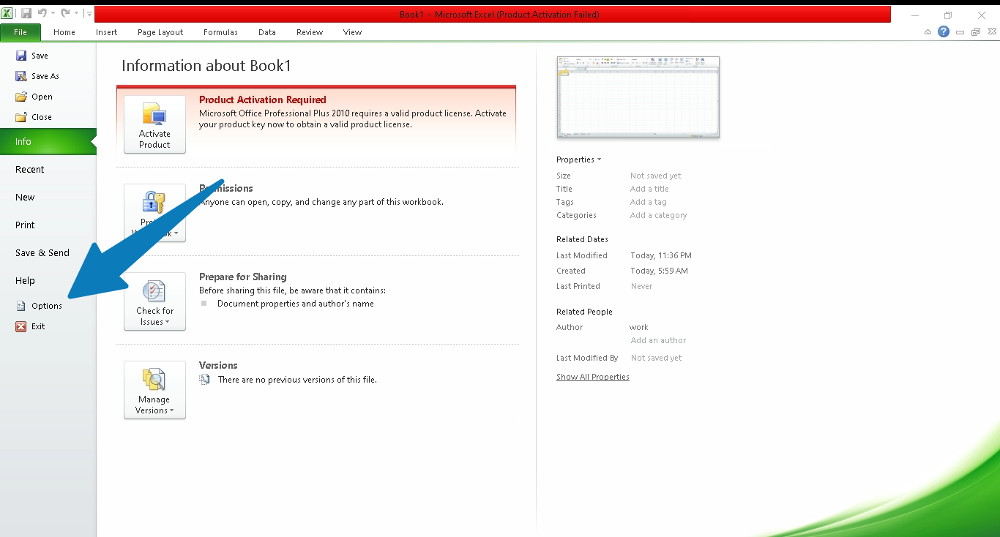
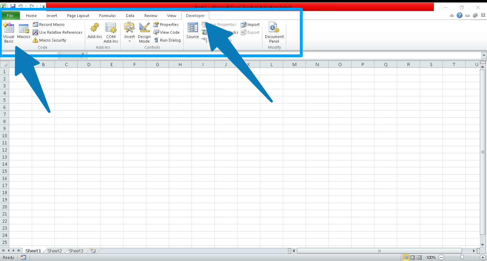
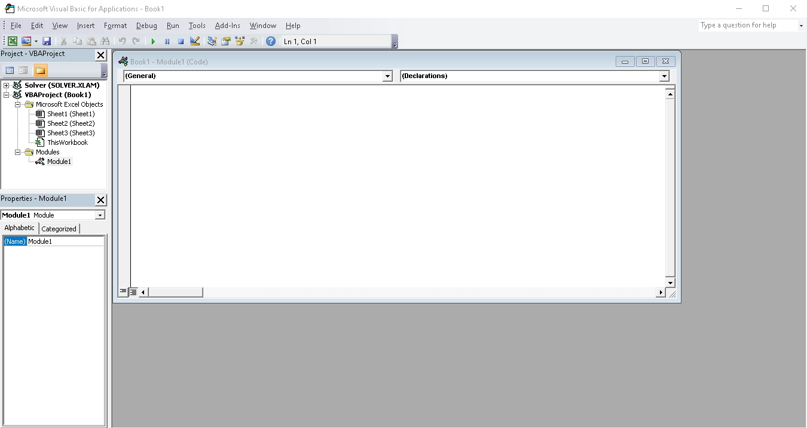
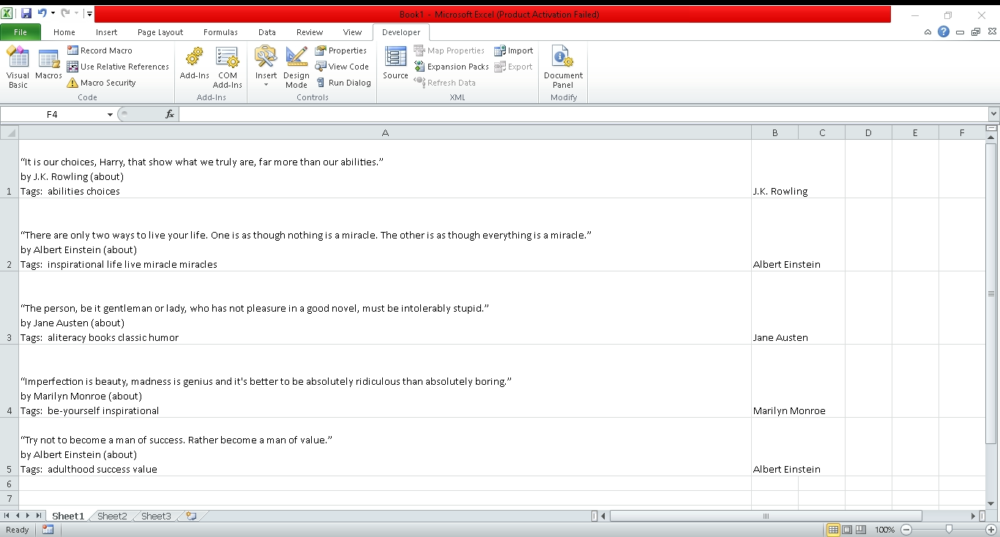

# Web Scraping With Excel VBA

[](https://oxylabs.go2cloud.org/aff_c?offer_id=7&aff_id=877&url_id=112)


- [Prerequisites](#prerequisites)
- [Step 1 - Open Microsoft Excel](#step-1---open-microsoft-excel)
- [Step 2 - Go to Option to enable developer menu](#step-2---go-to-option-to-enable-developer-menu)
- [Step 3 -  Select Customize Ribbon](#step-3----select-customize-ribbon)
- [Step 4 - Open Visual Basic Application Dialog](#step-4---open-visual-basic-application-dialog)
- [Step 5 - Insert a new Module](#step-5---insert-a-new-module)
- [Step 6 - Add new references](#step-6---add-new-references)
- [Step 7 - Automate Microsoft Edge to Open a website](#step-7---automate-microsoft-edge-to-open-a-website)
- [Step 8 - Scrape Data using VBA Script & Save it to Excel](#step-8---scrape-data-using-vba-script-and-save-it-to-excel)
- [Output](#output)
- [Source Code](#source-code)

In this tutorial, we'll focus on how to perform Excel web scraping using
VBA. We’ll briefly go through the installation and preparation of the
environment and then write a scraper using VBA macro to successfully
fetch data from a web page into Excel.

See the full [<u>blog post</u>](https://oxylabs.io/blog/web-scraping-excel-vba) for a detailed
explanation of VBA and its use in web scraping.

Before we begin, let’s make sure we’ve installed all the prerequisites
and set up our environment properly so that it will be easier to follow
along.

## Prerequisites

We’ll be using Windows 10 and Microsoft Office 10.
However, the steps will be the same or similar for other versions of
Windows. You’ll only need a computer with Windows Operating System. In
addition, it’s necessary to install Microsoft Office if you don’t have
it already. Detailed installation instructions can be found in
[<u>Microsoft's Official
documentation</u>](https://www.microsoft.com/en-us/download/office.aspx).

Now that you’ve installed MS Office, follow the steps below to set up
the development environment and scrape the public data you want.

## Step 1 - Open Microsoft Excel

From the start menu or Cortana search, find Microsoft Excel and open the application. You will see a similar interface as below:

Click on File


## Step 2 - Go to Option to enable developer menu

By default, Excel doesn’t show the developer button in the top ribbon. To enable this we will have to go to “Options” from the File menu.



## Step 3 -  Select Customize Ribbon

Once you click the “Options”, a dialog will pop up, from the side menu select “Customize Ribbon”. Click on the check box next to “developer”. Make sure it is ticked and then click on Ok.


## Step 4 - Open Visual Basic Application Dialog

Now you will see a new developer button on the top ribbon, clicking on it will expand the developer menu. From the menu, select “Visual Basic”



## Step 5 - Insert a new Module

Once you click on visual basic, it will open a new window like below:


Click on “insert” and select “Module” to insert a new module. It will open the module editor



## Step 6 - Add new references


From the top menu select `Tools >  References...`, it will open a new window like the one below. Make sure to scroll through the available list of references and find Microsoft HTML Client Library & Microsoft Internet Controls in the check box. Click on the check box next to both of them to enable these references.  Once you are done click ok.


That’s it! Our development environment is all set. Let’s write our first Excel VBA scraper

## Step 7 - Automate Microsoft Edge to Open a website

In this step, we will update our newly created module to open the following website: <https://quotes.toscrape.com>. In the module editor let’s write the below code:

```vb
Sub scrape_quotes()
    Dim browser As InternetExplorer
    Dim page As HTMLDocument
    Set browser = New InternetExplorer
    browser.Visible = True
    browser.navigate ("https://quotes.toscrape.com")
End Sub
```

We are defining a subroutine named `scrape_quotes()`. This function will be executed when we run this script. Inside the subroutine, we are defining two objects `browser` and  `page`.

The `browser` object will allow us to interact with Microsoft Edge. Then we also set the browser as visible so that we can see it in action. The browser.`navigate()` function tells the VBA browser object to open the URL.  The output will be similar to this:


>💡 Note: You might be wondering why we are writing `InternetExplorer` to interact with Microsoft Edge. VBA initially only supported Internet Explorer-based automation, but once Microsoft discontinued Internet Explorer. They deployed some updates so that VBA’s InternetExplorer module can run the Microsoft Edge browser in IEMode without any issues. The above code will also work in older Windows that have Internet Explorer still available instead of Edge.

## Step 8 - Scrape Data using VBA Script and Save it to Excel

Now, we will scrape the quotes and authors from the website. For simplicity, we will store it in the first Sheet of the excel spreadsheet and, grab the top 5 quotes for now.

We will begin by defining two new objects one for quotes & other for authors

```vb
    Dim quotes As Object
    Dim authors As Object
```

After navigating to the website we will also add a little bit of pause so that the website loads properly by using Loop.

```vb
Do While browser.Busy: Loop
```

Next we will grab the quotes and authors from the HTML document:

```vb
    Set page = browser.document
    Set quotes = page.getElementsByClassName("quote")
    Set authors = page.getElementsByClassName("author")
```

Then, we will use a for loop to populate the excel rows with the extracted data by calling the Cells function and passing the row and column position:

```vb
    For num = 1 To 5
        Cells(num, 1).Value = quotes.Item(num).innerText
        Cells(num, 2).Value = authors.Item(num).innerText
    Next num
```

Finally, we will close the browser by calling the quit function. This will close the browser Window.

```vb
    browser.Quit
```

## Output

Now if we run the script again, it will open Microsoft Edge and browse to the quotes.toscrape.com website, grab the top 5 quotes from the list and save them to the current excel file’s first sheet.



## Source Code

The full source code is given below:

```vb
Sub scrape_quotes()
    Dim browser As InternetExplorer
    Dim page As HTMLDocument
    Dim quotes As Object
    Dim authors As Object
    
    Set browser = New InternetExplorer
    browser.Visible = True
    browser.navigate ("https://quotes.toscrape.com")
    Do While browser.Busy: Loop
    
    Set page = browser.document
    Set quotes = page.getElementsByClassName("quote")
    Set authors = page.getElementsByClassName("author")
    
    For num = 1 To 5
        Cells(num, 1).Value = quotes.Item(num).innerText
        Cells(num, 2).Value = authors.Item(num).innerText
    Next num
    
    browser.Quit
End Sub
```


